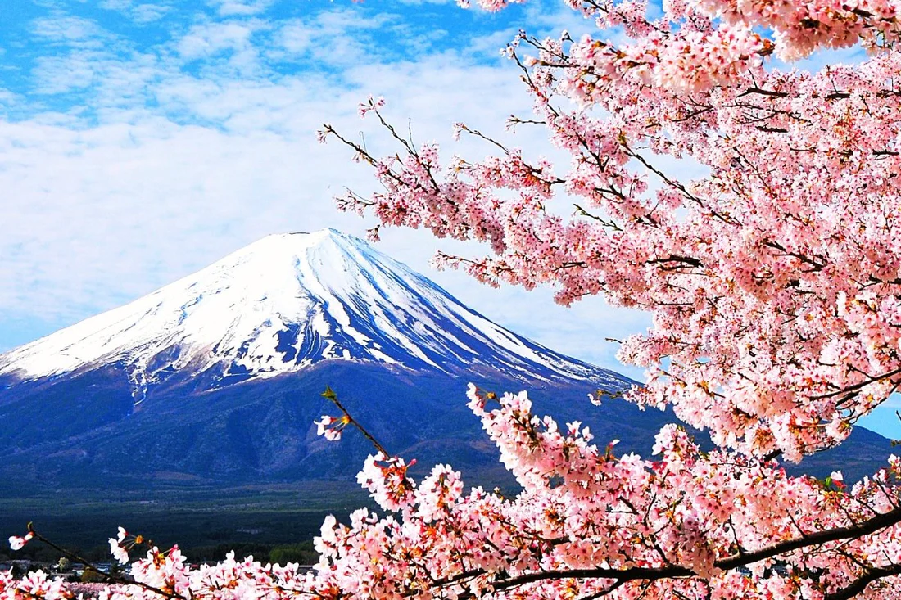
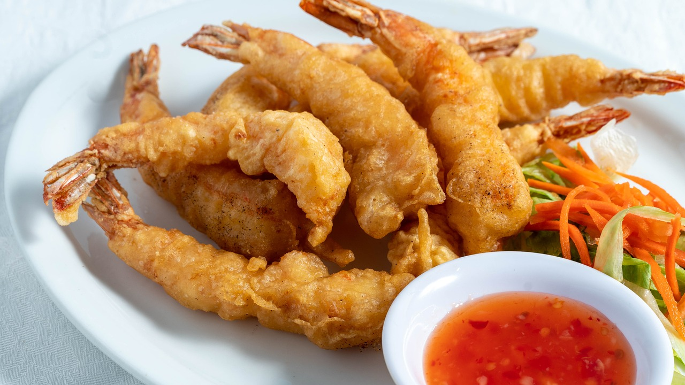

# Que podes hacer en 15 dias si estas en japon...
Japón es un destino turístico destacado por su mezcla única de tradición y modernidad, con paisajes que abarcan desde majestuosas montañas hasta vibrantes ciudades y tranquilos templos. Su rica cultura, influenciada por siglos de historia y filosofía, se refleja en su arte, gastronomía y festividades. Además, la fusión entre tecnología avanzada y antiguas tradiciones ofrece a los visitantes una experiencia singular, donde la serenidad de los santuarios y jardines coexiste con la innovación urbana. Este equilibrio convierte a Japón en un destino atractivo para todo tipo de viajeros.

### Sitios Imperdibles para Explorar: Un Recorrido por los Destinos Más Iconicos de Japón
Japón es famoso por sus impresionantes paisajes, desde playas rodeadas de aguas cristalinas hasta montañas icónicas. Ya sea disfrutando del bullicio de Tokio o la calma de los Alpes Japoneses, los viajeros encuentran en Japón una diversidad de entornos y experiencias.

**Top destinos Japón**
- **Monte Fuji** (Prefectura de Shizuoka/Yamanashi): Con sus 3.776 metros de altura, es el símbolo más reconocible de Japón y un destino popular tanto para excursionistas como para quienes buscan capturar su belleza desde diversos puntos de vista. 

- **Templo Kinkaku-ji** (Kioto): El Pabellón Dorado es uno de los templos más famosos de Japón. Su estructura cubierta en oro se refleja en un tranquilo estanque, creando una atmósfera de paz y espiritualidad.

- **Islas Okinawa**: Famosas por sus playas paradisíacas, aguas cristalinas y rica vida marina, Okinawa es un destino ideal para quienes buscan relajarse en el trópico o practicar buceo y snorkel.

- **Bosque de Bambú de Arashiyama** (Kioto): Este majestuoso bosque, con sus altos bambúes y senderos tranquilos, ofrece una experiencia única e inmersiva en la naturaleza.

- **Distrito de Shibuya** (Tokio): Conocido por el cruce de Shibuya, uno de los más transitados del mundo, este distrito es un símbolo del dinamismo y modernidad de Tokio. Aquí se encuentran algunos de los centros comerciales, restaurantes y bares más populares de la ciudad.

### Gastronomía Japonesa: Sabores Únicos y Tradiciones Culinarias
La gastronomía japonesa es famosa por su énfasis en la calidad y frescura de los ingredientes, y por su presentación estética que es casi una forma de arte. Los platos varían de una región a otra, pero en todos prevalece el respeto por la tradición y la simplicidad.

- **Platos Típicos**: Entre los platos más emblemáticos se encuentra el **sushi**, que combina arroz avinagrado con pescado crudo o mariscos, y el **ramen**, una sopa de fideos servida con caldo, carne y vegetales. Otro plato popular es el **tempura**, frituras ligeras de vegetales o mariscos, que destacan por su textura crujiente y delicada.

- **Bebidas**: El **sake**, una bebida alcohólica elaborada a base de arroz fermentado, es la bebida tradicional de Japón, ideal para acompañar diversos platos. También destacan los tés japoneses, especialmente el **matcha**, un té verde molido muy apreciado por su sabor y propiedades antioxidantes.

- **Cultura Gastronómica**: La gastronomía japonesa no solo se disfruta en restaurantes, sino también en mercados locales y festivales. Los mercados como Tsukiji (Tokio) son famosos por su oferta de pescados frescos, mientras que los festivales ofrecen la oportunidad de probar comidas callejeras como el **takoyaki** (bolas de pulpo) o el **yakitori** (brochetas de pollo asadas).

### Recursos Adicionales y Enlaces Útiles
1. Oficinas de Turismo:

   - [Japan National Tourism Organization](https://www.japan.travel/es/): Sitio oficial de turismo de Japón con información sobre destinos, atracciones y consejos para viajeros.
   Turismo de Kioto: Información sobre atracciones, eventos y actividades en la histórica ciudad de Kioto.

2. Guías de viaje:
   - [TripAdvisor Japón](https://www.tripadvisor.com.ar/Tourism-g294232-Japan-Vacations.html): Opiniones y consejos de viajeros sobre destinos y actividades en Japón.
    

3. Cultura y Eventos:
   - [Festival Gion Matsuri](https://www.gionmatsuri.jp/): Uno de los festivales más importantes de Japón, celebrado en Kioto, con desfiles y eventos que muestran la cultura tradicional japonesa.

4. Reservas y Transporte:
   - [Booking](www.booking.com) - Plataforma para reservar alojamientos en Japón.
   - [Airbnb](https://www.airbnb.com.ar/): Opción de hospedaje único y experiencias en Japón.
   - [Japan Rail Pass](https://www.japanrailpass.net/): Información y reservas del pase de tren para turistas, una excelente opción para recorrer el país.

### Descubre la Belleza de Japón: Un Viaje Visual
- #### Destinos Icónicos:

  - Monte Fuji

  
  - Templo Kinkaku-ji
  

- #### Gastronomía:
  - Sushi

   
  - Tempura

